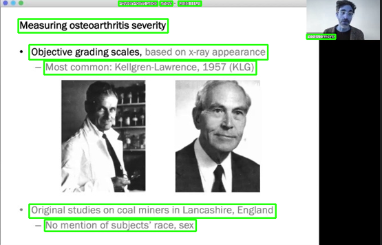

# Title Extraction in Lecture Slides Challenge by ITU AI/ML in 5G Challenge

## Description

YouTube’s “Video Chapter” feature segments a video into sections marked by timestamps so that the user can easily navigate to the part of the video which is of most interest. This can be done by clicking or pressing the chapter marker, or by selecting the timestamp in the video description.

In this problem statement we want to take this feature further. In webinars where speakers present slides, participants of the problem statement are asked to create the best AI model which annotates slides by identifying (apparent) titles in frames extracted from presentations.

Recordings of 100 “AI for Good” webinars were sourced to assemble a diverse collection of more than 140 video presentations made by members of the scientific community, entrepreneurs, and standardization experts. These were then segmented into frames containing the slides with titles.

An automated slide annotation in videos will improve accessibility of lecture-like content and enable better analytics.

About AI for Good - International Telecommunication Union (ITU)
 

AI for Good is organized by ITU in partnership with 40 UN Sister Agencies. The goal of AI for Good is to identify practical applications of AI to advance the United Nations Sustainable Development Goals and scale those solutions for global impact. It’s the leading action-oriented, global & inclusive United Nations platform on AI.

## Evaluation
The evaluation metric for this challenge is Word Error Rate Metric.

You can read more about WER in this medium article. Here are some libraries to start off with.

For every row in the dataset, submission files should contain 2 columns: ID and transcription.

Your submission file should look like this:

|ID	|Title1|
|---|------|
|0	|New robot technologies improve worker safety|
|1	|11% of manually driven forklifts will be involved in incidents with injury likely|

[More on Zindi](https://zindi.africa/competitions/title-extraction-in-lecture-slides-challenge)
## Approach

Training multiple segmentation models (DeepLabV3 and FCN) from torchvision with different classifier backbones(ResNet50 and ResNet101).

Then Ensembling them using an adaptated Voting to avoid overfitting.

## What we tried and that didn't work

- Data Augmentation (met some error related to the classification metric trying to solve a multiclass problem instead of a binary one after few iterations).

- Lowering or increasing the learning rate from the default value of 1e-4

- Saving Notebook versions didn't work on colab (had to persist variables and files in interactive sessions)

- Using the defaut batch size of 8

## What worked great

- Increasing the number of epochs 
- Using default weights
- Using maximum numberof available processors
- Lowering the batch size to 4

## Environment

- Kaggle with GPU100 and Python3.10
- Jupyter Notebooks
- Interactive session

## What to experiment

- Hyperparameters tuning
- Create custom data augmentation classes  (reallyhelped to reduce overfitting)
- Change Optimizers and metric
- Try to run model with more epochs
- Increase batch size
- ...